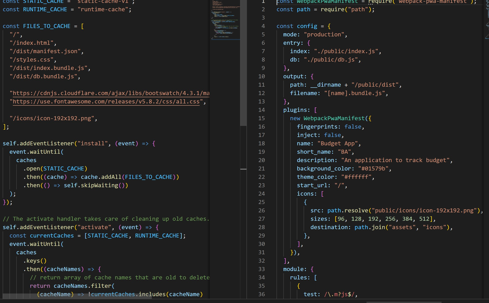

# Budget Tracker

## Description

This project uses express and mongoose to create a Progressive Web Application. To do this, the webpack package has been used to allow offline functioning. Other useful tools were indexedDb to refresh the database when the app returns online.

## Table Of Contents

- [Installation](##Installation)
- [Usage](##Usage)
- [License](##License)
- [Contributing](##Contributing)
- [Tests](##Tests)
- [Questions](##Questions)

## Installation

The user can input money spent or money made using the UI, it is then stored either in the static-cache or in the database if online. This data is returned to database when the user returns online after being offline

## Usage

## License

This project is covered under the MIT License

## Contributing

[bencyna](https://github.com/bencyna/)

## Tests

Go to

## Questions

If you have any questions about this project, you can veiw my github account at https://github.com/bencyna
